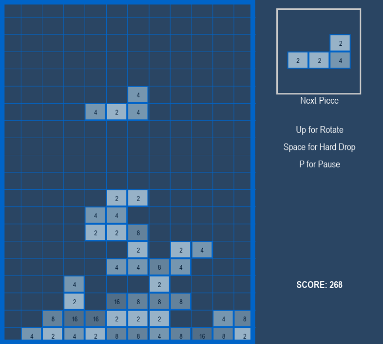

# Tetris 2048
Tetris 2048 is a hybrid puzzle game that combines the mechanics of two classic games: Tetris and 2048.
Place falling tetrominoes strategically, merge matching numbered tiles vertically, clear full rows, and aim to create a tile with the value 2048.

## Showcase

## How to Play

Move falling pieces using the Left, Right, and Down arrow keys.

Rotate pieces with the Up arrow key.

Hard drop pieces instantly using the Spacebar.

Press P to pause or resume the game.

While paused, press M to return to the main menu.

Winning Condition:

Merge tiles to create a 2048 tile.

Losing Condition:

If the blocks stack up and reach the top of the grid, the game is over.

## Features
Four difficulty levels: Easy, Normal, Hard, and Lunatic.

Smooth 60 FPS gameplay with independent gravity speed.

Vertical cascading merges just like 2048.

Selective gravity: unsupported tiles fall naturally.

Score tracking and game-over / victory screens.

Pause and return to menu functionality.